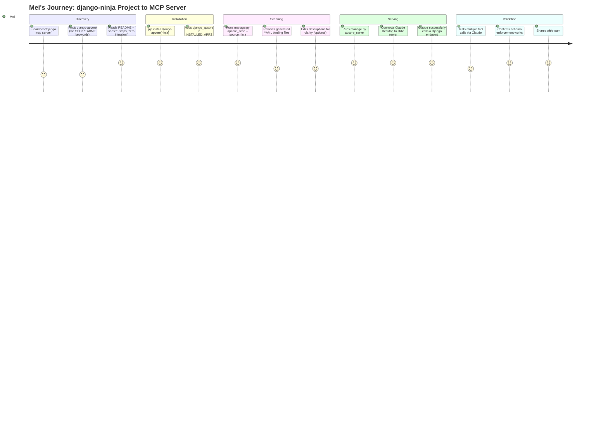
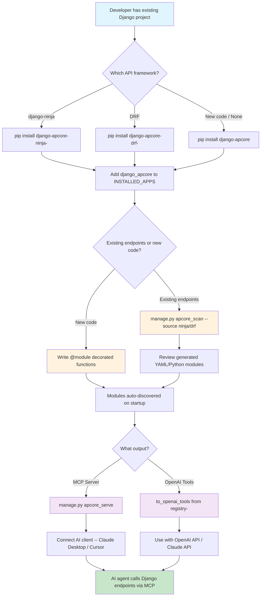
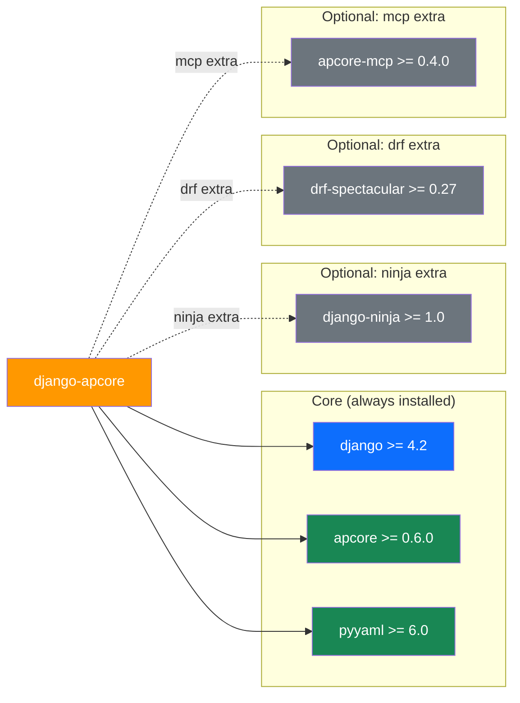
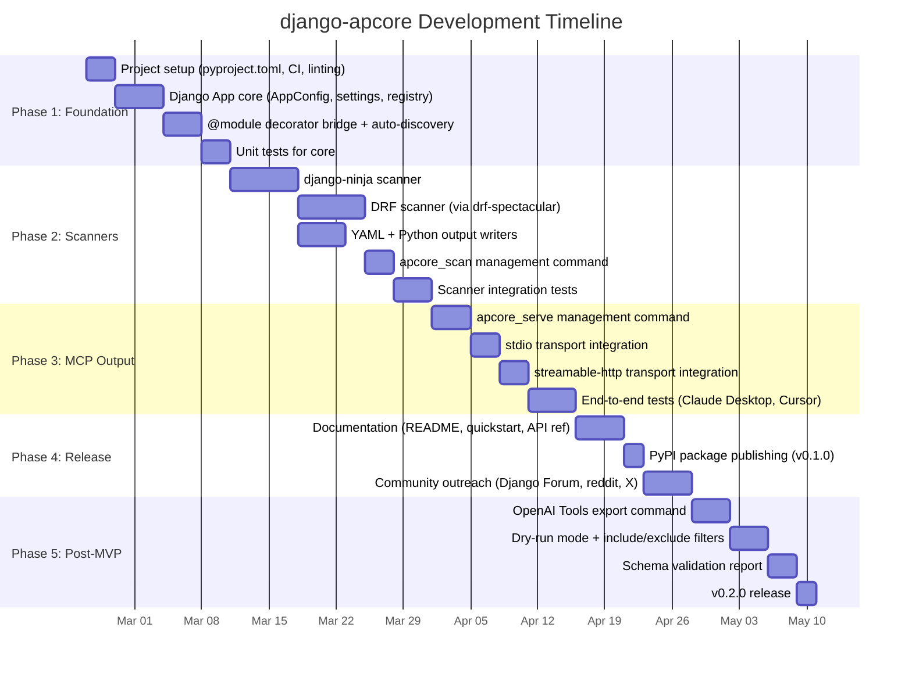

# Product Requirements Document: django-apcore

---

## 1. Document Information

| Field              | Value                                                      |
| ------------------ | ---------------------------------------------------------- |
| Product Name       | django-apcore                                              |
| Document Version   | 2.0                                                        |
| Author             | Product Team                                               |
| Status             | Draft                                                      |
| Created            | 2026-02-19                                                 |
| Last Updated       | 2026-02-23                                                 |
| Repository         | /Users/tercel/WorkSpace/aiperceivable/django-apcore/         |
| Sister Project     | /Users/tercel/WorkSpace/aiperceivable/apcore-mcp-python/     |
| Idea Source        | ideas/django-apcore/draft.md (5 brainstorming sessions)    |

---

## 2. Revision History

| Version | Date       | Author       | Changes                                   |
| ------- | ---------- | ------------ | ----------------------------------------- |
| 0.1     | 2026-02-18 | Product Team | Initial research (Sessions 1-3)           |
| 0.2     | 2026-02-19 | Product Team | User persona validation (Session 4)       |
| 0.3     | 2026-02-19 | Product Team | MVP scope refinement (Session 5)          |
| 1.0     | 2026-02-19 | Product Team | Full PRD based on 5 validated sessions    |
| 2.0     | 2026-02-23 | Product Team | Updated for apcore v0.6.0 + apcore-mcp v0.4.0 (Extension-First redesign) |

---

## 3. Executive Summary

**django-apcore** is an open-source Python library that brings the apcore (AI-Perceivable Core) protocol to Django. It enables Django developers to expose their existing APIs and business logic as MCP Servers and OpenAI-compatible Tools with zero code modification -- in as few as 3 steps.

The Django MCP ecosystem is severely fragmented: 8+ packages exist, none has achieved dominance, and their combined monthly downloads (approximately 56,600) represent just 1.2% of what FastAPI's MCP solution achieves (4.6M/month). Every existing Django MCP package operates as a transport layer without protocol-level module definition standards or schema enforcement. Meanwhile, Django's own API framework ecosystem is maturing rapidly -- django-ninja has grown 67% year-over-year to 1.35M monthly downloads, and 49% of Django developers use DRF.

django-apcore addresses this gap through a protocol-first architecture: rather than wrapping MCP transport, it defines AI-perceivable modules via the apcore protocol (with mandatory input/output schemas and descriptions), then uses the existing apcore-mcp-python library to output MCP Servers and OpenAI Tools from the same definition. Its layered architecture serves three user segments without hard dependencies: ML/AI teams writing new code (via `@module` decorator), DRF users (via `apcore_scan --source drf`), and django-ninja users (via `apcore_scan --source ninja`).

This is a personal open-source project by a solo developer with no hard deadlines. Success is measured by PyPI downloads, GitHub stars, community feedback, and proving the viability of the apcore protocol within the Django ecosystem.

---

## 4. Product Overview & Background

### 4.1 What Is apcore?

apcore (AI-Perceivable Core) is a schema-driven module development framework protocol specification. Its core principle is that every interface should be natively perceivable and understandable by AI. It achieves this through mandatory `input_schema`, `output_schema`, and `description` fields on every module definition. The apcore SDK (v0.6.0) provides:

- Three module definition styles: class-based, `@module` decorator, YAML external binding
- `BindingLoader` supporting auto_schema, inline JSON Schema, and schema_ref
- `Registry` with auto-discovery, custom discoverer/validator hooks, and hot-reload
- `Executor` with a 10-step execution pipeline (including ACL, middleware, validation)
- **Extension System** with 5 extension points (discoverer, middleware, acl, span_exporter, module_validator)
- **AsyncTaskManager** for background task orchestration with status tracking and cancellation
- **CancelToken** for cooperative cancellation of module execution
- **W3C TraceContext** utilities for distributed tracing propagation

### 4.2 What Is apcore-mcp-python?

apcore-mcp-python (v0.4.0) is the sister project that converts any apcore Registry into:

- **MCP Server** (stdio / streamable-http / sse) via `serve(registry)` with Prometheus metrics, input validation, and module filtering
- **OpenAI-compatible Tools** via `to_openai_tools(registry)` with strict mode and annotation embedding

It is a zero-intrusion library that does not modify original apcore modules and supports dynamic module registration/deregistration.

### 4.3 What Is django-apcore?

django-apcore is the Django implementation layer that:

1. Provides a Django App (`django_apcore`) with settings, AppConfig, and Extension-First auto-discovery
2. Offers scanners that convert existing Django API endpoints into apcore module definitions
3. Exposes management commands (`apcore_scan`, `apcore_serve`, `apcore_export`, `apcore_tasks`) for the zero-intrusion workflow
4. Implements apcore's Discoverer and ModuleValidator protocols for Django-native integration
5. Integrates all apcore v0.6.0 capabilities: Extension System, AsyncTaskManager, CancelToken, TraceContext
6. Delegates MCP/OpenAI output to apcore-mcp-python (optional dependency)

### 4.4 Why Now?

- **MCP adoption has exploded**: 10,000+ active MCP servers, 97M monthly SDK downloads (Dec 2025). Anthropic open-sourced MCP in Nov 2024; OpenAI adopted it in Mar 2025; Google DeepMind confirmed Gemini support in Apr 2025.
- **Django is underserved**: The 82:1 download gap between fastapi-mcp and all Django MCP packages combined shows massive unmet demand.
- **django-ninja's MCP gap is confirmed**: The django-ninja maintainer explicitly declined built-in MCP support (Issue #1449), pushing it to third-party packages -- creating a clear market opening.
- **DjangoCon 2025 keynote featured MCP**: "Django Reimagined For The Age of AI" by Marlene Mhangami (Microsoft) included a live MCP demo, signaling official community interest.

---

## 5. Market Research & Analysis

### 5.1 Total Addressable Market (TAM)

The TAM represents all Python web developers who could benefit from exposing their applications to AI agents.

| Metric | Value | Source |
| ------ | ----- | ------ |
| Django PyPI monthly downloads | ~25.5M | PyPI Stats, Feb 2026 |
| Companies using Django | 42,880+ | 6Sense |
| Django market share (web frameworks) | 32.90% | 6Sense |
| MCP monthly SDK downloads (Python + TS) | 97M | Dec 2025 |
| Active MCP servers | 10,000+ | Dec 2025 |
| Agent orchestration market (projected) | $30B by 2030 | Industry reports, 2025 |
| 2026 projection: API gateway vendors with MCP | 75% | Industry analysis |

**TAM estimate**: 42,880+ companies using Django, with 93% of all developers using AI regularly (JetBrains AI Pulse 2026). The pool of Django projects that could expose AI-perceivable endpoints is bounded by the 25.5M monthly Django downloads -- representing hundreds of thousands of active Django projects.

### 5.2 Serviceable Addressable Market (SAM)

The SAM narrows to Django developers who actively build APIs (not full-stack template rendering) and could realistically adopt django-apcore.

| Segment | % of Django Community | Monthly Proxy (Downloads) | Source |
| ------- | --------------------- | ------------------------- | ------ |
| DRF users | ~49% | ~12.5M (est. from Django base) | State of Django 2025 |
| django-ninja users | ~10% (+67% YoY) | 1,352,223 | PyPI Stats |
| ML/AI companies on Django | ~8-10% (2,800+) | N/A | 6Sense |

**SAM estimate**: Approximately 59% of Django developers build APIs (49% DRF + 10% django-ninja). Applied to the 42,880 companies: roughly 25,300 companies have Django API endpoints that could be exposed as MCP tools. Adding 2,800+ ML/AI companies that may write new apcore modules, the SAM is approximately **25,000-28,000 companies**.

### 5.3 Serviceable Obtainable Market (SOM)

The SOM accounts for realistic adoption constraints: apcore's novelty, solo developer capacity, and the "80% full-stack" demographic that is unlikely to adopt.

| Factor | Impact |
| ------ | ------ |
| 80% of Django devs are full-stack (not API-first) | Reduces addressable base significantly |
| apcore is an unknown protocol | Early adopters only (~2-5% of SAM) |
| Solo developer, no marketing budget | Organic growth only |
| Competing with 8+ existing packages | Must win on differentiation, not awareness |

**SOM estimate (Year 1)**: 500-1,500 monthly PyPI downloads, targeting early-adopter API-first Django developers and ML/AI teams. This represents approximately 0.1-0.3% of Django's total download base -- comparable to drf-mcp or django-rest-framework-mcp's current adoption levels, but with a path to django-mcp-server-level traction (53K/month) within 18-24 months if the protocol resonates.

### 5.4 Market Trends

**Favorable:**
- MCP protocol adoption is accelerating (Anthropic, OpenAI, Google, Microsoft all on board)
- django-ninja growth at +67% YoY indicates appetite for modern Django patterns
- 69% of Django developers already use ChatGPT; 15% use Claude (State of Django 2025)
- DjangoCon 2025 keynote explicitly featured MCP as the future of Django + AI

**Unfavorable:**
- Django Forum MCP threads have low engagement (1-7 replies each)
- No Django+MCP discussions found on Reddit, Stack Overflow, or Twitter/X
- 80% of Django developers are full-stack template users, not API-first developers
- "MCP tools are most often completely different than regular REST" (django-ninja maintainer) suggests the scanner approach may have fundamental friction

### 5.5 Corporate MCP Adoption Timeline

| Date | Event |
| ---- | ----- |
| Nov 2024 | Anthropic open-sources MCP |
| Mar 2025 | OpenAI adopts MCP |
| Apr 2025 | Google DeepMind confirms Gemini MCP support |
| 2025 | Microsoft, Cloudflare, Vercel, Netlify add MCP support |
| Aug 2025 | fastapi-mcp hits #1 trending on GitHub for Python |
| Oct 2025 | DjangoCon US 2025 keynote features MCP demo |
| Dec 2025 | 10,000+ active MCP servers, 97M monthly SDK downloads |
| 2026 (proj.) | 75% of API gateway vendors expected to have MCP features |

---

## 6. Value Proposition & Validation

### 6.1 Core Value Proposition

**For Django API developers** who need to expose their existing endpoints to AI agents, **django-apcore** provides a zero-intrusion, protocol-first path from Django project to MCP Server in 3 steps -- **unlike** existing Django MCP packages that are fragmented transport layers without schema enforcement, and **unlike** fastapi-mcp which requires abandoning Django entirely.

**Key differentiators over every existing solution:**

| Differentiator | django-apcore | All 8+ competitors |
| -------------- | ------------- | ------------------- |
| Protocol-level module standard (apcore) | Yes | No -- all are MCP transport layers |
| Multi-output (MCP Server + OpenAI Tools) | Yes (via apcore-mcp-python) | No -- MCP only |
| Mandatory schema enforcement | Yes (apcore spec requires input/output schemas) | No -- most auto-discover without enforcement |
| Framework-agnostic core | Yes (no hard dependency on DRF or ninja) | Most are DRF-only or ninja-only |
| Dual adoption path (decorator + scanner) | Yes | Partial at best |

### 6.2 Demand Evidence (Concrete, Not Assumed)

| Evidence | Detail | Source |
| -------- | ------ | ------ |
| 82:1 download gap | fastapi-mcp gets 4.6M/month vs 56.6K for all Django MCP packages combined | PyPI Stats, Feb 2026 |
| 8+ fragmented packages | No dominant Django MCP solution despite clear demand | GitHub/PyPI analysis, Feb 2026 |
| django-ninja #1449 declined | Maintainer explicitly pushed MCP to third-party packages, creating a market opening | GitHub Issue, 2025 |
| DjangoCon 2025 keynote | "Django Reimagined For The Age of AI" with live MCP demo | DjangoCon US 2025 |
| Django core contributor positive | "I think it would be worth working on" (Django Forum) | Django Forum, 2025-2026 |
| django-ninja-mcp abandoned | Closest competitor to django-apcore's vision is 10 months stale | GitHub, Apr 2025 last commit |
| fastapi-mcp market proof | 11,500 stars, 4.3M downloads proves framework-specific MCP integration is a high-demand category | GitHub/PyPI, Feb 2026 |

### 6.3 What Happens If We Don't Build This?

If django-apcore is not built, Django developers who need MCP capabilities will:

1. **Use django-mcp-server** (274 stars, 1M+ downloads) -- the most mature option, but it has no schema enforcement, no protocol standard, and a proprietary declarative style that is not portable beyond MCP.

2. **Use the official MCP Python SDK directly** -- requires manual integration, no Django-native patterns, significant boilerplate.

3. **Use mcp-django or django-ai-boost** -- but these are development-time tools for AI assistants to understand your code, not for exposing business logic to AI agents.

4. **Migrate to FastAPI + fastapi-mcp** -- this is the most dangerous outcome. fastapi-mcp's "just works" experience (11,500 stars) creates a strong pull for Django developers to abandon Django for AI use cases. Every Django developer who migrates to FastAPI for MCP is one fewer Django developer in the ecosystem.

**The cost of inaction is not "nothing changes" -- it is continued fragmentation, continued migration pressure toward FastAPI, and the apcore protocol remaining unproven in the most popular Python web framework.**

---

## 7. Feasibility Analysis

### 7.1 Technical Feasibility

| Component | Feasibility | Rationale |
| --------- | ----------- | --------- |
| Django App (settings, AppConfig) | **High** | Standard Django patterns, well-documented |
| django-ninja scanner | **High** | django-ninja uses Pydantic natively; `model_json_schema()` and `api.get_openapi_schema()` provide complete schema data |
| DRF scanner (via drf-spectacular) | **Medium-High** | drf-spectacular provides full OpenAPI 3.0 via `SchemaGenerator.get_schema()`, but edge cases exist (SerializerMethodField, custom serializers) |
| @module decorator (new code) | **High** | apcore SDK already provides complete decorator support; django-apcore only needs bridging |
| MCP output (via apcore-mcp-python) | **High** | apcore-mcp-python v0.1.0 is already built and tested; `serve(registry)` is the entire integration surface |
| Management commands | **High** | Standard Django management command patterns |

**Technical verdict**: All MVP components are technically feasible. The highest-risk component is the DRF scanner due to serializer edge cases, but drf-spectacular has already solved most of these.

### 7.2 Resource Feasibility

| Factor | Assessment |
| ------ | ---------- |
| Developer | Solo developer, personal project |
| Timeline | No hard deadlines |
| Dependencies | apcore SDK v0.2.0+ (controlled by same team), apcore-mcp-python v0.1.0 (already built) |
| External dependencies | django>=4.2 (stable), pydantic>=2.0 (stable), django-ninja>=1.0 (stable), drf-spectacular>=0.27 (stable) |
| Infrastructure | PyPI publishing, GitHub hosting -- no cost |

**Resource verdict**: The project is resource-feasible for a solo developer because: (a) critical dependencies are already built or stable, (b) the MVP scope is bounded to 5 modules, and (c) there are no infrastructure costs or team coordination overhead.

### 7.3 Market Feasibility

| Factor | Assessment |
| ------ | ---------- |
| Demand signal strength | **Medium** -- indirect signals strong (82:1 gap, DjangoCon keynote, ninja #1449), direct signals weak (no Reddit/SO discussions, low Django Forum engagement) |
| Competitive positioning | **Strong** -- no competitor offers protocol-first, multi-output, schema-enforced approach |
| Adoption barriers | **Medium-High** -- apcore is an unknown protocol; developers may prefer direct MCP; "django-apcore" is not discoverable via "django mcp" search |
| Community risk | **Medium** -- "not invented here" resistance; Django community may prefer contributing to existing packages |

### 7.4 Feasibility Verdict

**CONDITIONAL GO**

Conditions for proceeding:

1. **apcore SDK v0.2.0 must be stable and documented** before django-apcore v0.1.0 release. If the underlying protocol is not ready, django-apcore inherits all its instability.

2. **Discoverability must be addressed proactively.** The package description, README, and PyPI metadata must prominently feature "django mcp server" keywords. Without this, the project will not be found by developers searching for MCP solutions.

3. **The scanner approach must be validated early.** The django-ninja maintainer's comment that "MCP tools are most often completely different than regular REST" is a real concern. If scanning existing endpoints produces low-quality MCP tools, the zero-intrusion promise loses credibility. Early user testing of scanner output quality is essential.

4. **Solo developer risk must be acknowledged.** Maintenance, issue triage, and community building are significant time commitments. If the project gains traction, a plan for managing contributions or finding co-maintainers should be developed.

**Rationale for not granting unconditional GO**: The primary risk is that apcore itself has no proven community adoption. django-apcore is an implementation of a protocol that may not gain traction, regardless of django-apcore's quality. The 82:1 download gap proves demand for Django+MCP integration, but it does not prove demand for apcore specifically. If apcore adoption stalls, django-apcore becomes an extra abstraction layer between Django and MCP with no clear benefit over using the MCP Python SDK directly.

---

## 8. Problem Statement

### 8.1 The Problem

Django developers who want to expose their application logic to AI agents (via MCP or OpenAI tool calling) face three compounding problems:

1. **Ecosystem fragmentation**: 8+ Django MCP packages exist, none dominant. The most-starred (django-mcp-server at 274 stars) has just 2.4% of fastapi-mcp's stars. Developers cannot make a confident choice.

2. **No protocol-level standards**: Every existing package is a "transport layer" that wraps MCP without enforcing module contracts. Tools lack mandatory schemas, descriptions, or structured inputs/outputs -- making them unreliable for AI agent consumption.

3. **Migration pressure**: fastapi-mcp's 82:1 download advantage over all Django MCP packages combined creates a gravitational pull toward FastAPI. Django developers starting AI-integrated projects increasingly default to FastAPI, fragmenting their tech stack.

### 8.2 Who Is Affected

| User Segment | Size | Pain |
| ------------ | ---- | ---- |
| ML/AI companies on Django | 2,800+ companies | Must expose models/pipelines to AI agents; no Django-native solution with schema enforcement |
| DRF API developers | ~49% of Django devs | Have structured APIs that could be MCP tools, but conversion requires manual boilerplate or poor-quality auto-discovery |
| django-ninja developers | ~10% of Django devs (+67% YoY) | Already use Pydantic schemas; closest to MCP-ready, but django-ninja-mcp is abandoned and the maintainer declined built-in support |

### 8.3 Current Workarounds and Their Costs

| Workaround | Cost |
| ---------- | ---- |
| Use django-mcp-server | No schema enforcement, proprietary patterns, not portable beyond MCP |
| Use MCP Python SDK directly | Significant boilerplate, no Django-native patterns, manual schema definition |
| Switch to FastAPI + fastapi-mcp | Abandons Django expertise, splits tech stack, migration cost |
| Use django-ninja-mcp | Abandoned (10 months stale), depends on unmerged django-ninja PR |
| Do nothing | AI agents cannot interact with the Django application |

---

## 9. Goals and Non-Goals

### 9.1 Goals

| ID | Goal | Measurable Target |
| -- | ---- | ----------------- |
| G1 | Enable zero-intrusion MCP Server creation from existing Django projects | 3 steps or fewer, no source code modification required |
| G2 | Enforce schema quality on all AI-perceivable modules | 100% of modules have input_schema, output_schema, and description |
| G3 | Support both DRF and django-ninja ecosystems | Scanner output for both frameworks passes apcore schema validation |
| G4 | Prove apcore protocol viability in Django | At least 1 production deployment documented within 6 months |
| G5 | Achieve meaningful PyPI adoption | 500+ monthly downloads within 3 months of release |
| G6 | Enable multi-output from single definition | Same module definition works as MCP Server AND OpenAI Tools |

### 9.2 Non-Goals (Explicit Exclusions)

| ID | Non-Goal | Rationale |
| -- | -------- | --------- |
| NG1 | Django Auth/Permission to apcore ACL mapping | Adds complexity; MVP focuses on module definition, not access control |
| NG2 | Django Middleware to apcore Middleware bridging | Requires deep Django internals knowledge; deferred to post-MVP |
| NG3 | Django Admin integration | Not aligned with API-first target users |
| NG4 | Request/user context auto-injection | Complex Django-specific behavior; modules should use Django ORM directly |
| NG5 | Pure Django views scanner | Technically infeasible -- plain views lack structured output schemas |
| NG6 | Replacing or competing with fastapi-mcp | Different framework, complementary positioning |
| NG7 | Building a commercial product or SaaS | Pure open-source, community adoption focus |
| NG8 | Supporting Django versions below 4.2 | Django 4.2 is the current LTS; older versions are EOL |

---

## 10. User Personas

### Persona 1: Mei -- ML Engineer at an AI Startup

| Attribute | Detail |
| --------- | ------ |
| Role | ML Engineer |
| Company | AI startup (Series A, 15 people) |
| Django experience | 2 years |
| API framework | django-ninja (chosen for Pydantic support) |
| AI tools usage | Daily -- Claude, GPT-4, Cursor |
| Pain point | Needs to expose ML inference endpoints to internal AI agents; evaluated fastapi-mcp but the rest of the stack is Django |
| Goal | Turn existing django-ninja endpoints into MCP tools without rewriting anything |
| Entry point | `pip install django-apcore[ninja]` then `manage.py apcore_scan --source ninja` |

### Persona 2: Carlos -- Senior Backend Developer at a SaaS Company

| Attribute | Detail |
| --------- | ------ |
| Role | Senior Backend Developer |
| Company | B2B SaaS (50 people, Series B) |
| Django experience | 5 years |
| API framework | DRF with drf-spectacular for OpenAPI docs |
| AI tools usage | Occasional -- GitHub Copilot for code completion |
| Pain point | Product manager wants to expose internal APIs to AI agents for customer support automation; current approach is custom FastAPI microservice |
| Goal | Expose existing DRF ViewSets as MCP tools without building a separate service |
| Entry point | `pip install django-apcore[drf]` then `manage.py apcore_scan --source drf` |

### Persona 3: Yuki -- Full-Stack Developer Building AI-First Features

| Attribute | Detail |
| --------- | ------ |
| Role | Full-Stack Developer |
| Company | Solo/indie developer building an AI-powered product |
| Django experience | 3 years |
| API framework | None specific -- writes plain Django views and is building new AI-specific logic |
| AI tools usage | Heavy -- building features that AI agents call |
| Pain point | Wants to define AI-callable modules from scratch with enforced schemas; tired of ad-hoc JSON parsing |
| Goal | Use `@module` decorator to define clean, schema-enforced modules that AI agents can discover and call |
| Entry point | `from apcore import module` then writes new `@module`-decorated functions |

---

## 11. User Stories

### US-01: Scan django-ninja Endpoints

**As** Mei (django-ninja developer), **I want to** run a single command that scans my existing django-ninja API and generates apcore module definitions, **so that** I can expose my endpoints as MCP tools without modifying any source code.

**Acceptance Criteria:**
- `python manage.py apcore_scan --source ninja` discovers all NinjaAPI instances in the project
- Each endpoint is converted to an apcore module with input_schema (from Pydantic models), output_schema, and description (from OpenAPI spec)
- Output is written as YAML binding files to a configurable directory (default: `apcore_modules/`)
- Endpoints with missing descriptions generate a warning, not a failure
- The command completes in under 10 seconds for a project with 50 endpoints

### US-02: Scan DRF ViewSets

**As** Carlos (DRF developer), **I want to** scan my existing DRF ViewSets and generate apcore module definitions using drf-spectacular's OpenAPI output, **so that** I can expose my REST APIs to AI agents.

**Acceptance Criteria:**
- `python manage.py apcore_scan --source drf` discovers all registered DRF ViewSets
- Uses `drf-spectacular`'s `SchemaGenerator.get_schema()` to extract OpenAPI 3.0
- Converts OpenAPI components/schemas into apcore input/output schemas
- Handles standard CRUD operations (list, create, retrieve, update, destroy)
- Warns on unsupported serializer patterns (e.g., SerializerMethodField without type hints)
- Output format matches the same YAML/Python structure as the ninja scanner

### US-03: Start MCP Server

**As** any django-apcore user, **I want to** start an MCP Server from my scanned/defined modules with a single command, **so that** AI agents (Claude Desktop, Cursor) can discover and call my Django endpoints.

**Acceptance Criteria:**
- `python manage.py apcore_serve` loads all registered apcore modules and starts an MCP Server
- Default transport is stdio (compatible with Claude Desktop and Cursor)
- `--transport streamable-http --host 0.0.0.0 --port 8080` starts an HTTP-based MCP Server
- The server lists all registered tools with their schemas when queried by an MCP client
- A tool call executes the underlying Django function and returns structured output
- Requires `apcore-mcp` optional dependency; provides a clear error message if not installed

### US-04: Define New Module with Decorator

**As** Yuki (new code developer), **I want to** define AI-callable modules using a Python decorator with Pydantic type hints, **so that** I get schema enforcement and AI-perceivability without manual schema writing.

**Acceptance Criteria:**
- `@module(description="...", tags=[...])` decorator registers a function as an apcore module
- Input schema is auto-generated from function parameter type hints
- Output schema is auto-generated from return type annotation
- Functions can use Django ORM directly (e.g., `User.objects.create(...)`)
- Modules are auto-discovered by AppConfig on Django startup
- Missing description raises a validation error at registration time

### US-05: Configure via Django Settings

**As** any django-apcore user, **I want to** configure django-apcore behavior through standard Django settings, **so that** I do not need to learn a separate configuration system.

**Acceptance Criteria:**
- Adding `'django_apcore'` to `INSTALLED_APPS` activates the app
- `APCORE_MODULE_DIR` setting controls where scanned modules are stored (default: `apcore_modules/`)
- `APCORE_AUTO_DISCOVER` setting controls whether modules are auto-discovered on startup (default: `True`)
- `APCORE_SERVE_TRANSPORT` setting controls default transport for `apcore_serve` (default: `stdio`)
- Invalid settings raise `ImproperlyConfigured` with clear error messages
- All settings have sensible defaults -- zero configuration required for basic usage

### US-06: Choose Output Format for Scanner

**As** a django-apcore user, **I want to** choose between YAML binding files and Python decorator code as the scanner output format, **so that** I can pick the format that best fits my workflow.

**Acceptance Criteria:**
- `--output yaml` generates YAML binding files (default)
- `--output python` generates Python files with `@module` decorators
- Both formats produce identical apcore module registrations when loaded
- Generated Python code is valid, runnable, and follows PEP 8
- Generated YAML conforms to apcore binding specification

### US-07: Export as OpenAI Tools

**As** a developer integrating with OpenAI-compatible APIs, **I want to** export my apcore modules as OpenAI tool definitions, **so that** I can use them with GPT-4, Claude API, or any OpenAI-compatible service.

**Acceptance Criteria:**
- apcore Registry populated by django-apcore can be passed to `apcore-mcp-python`'s `to_openai_tools(registry)`
- Output conforms to OpenAI's tool calling JSON Schema format
- Each tool includes name, description, and parameters with JSON Schema
- Management command or Python API provides this export capability

---

## 12. Functional Requirements Overview

### P0 -- Must Have (MVP Launch Blockers)

| ID | Feature | Description | User Story |
| -- | ------- | ----------- | ---------- |
| PRD-DAP-001 | Django App Core | `django_apcore` Django app with AppConfig, settings (`APCORE_*`), and auto-discovery of apcore modules on startup | US-05 |
| PRD-DAP-002 | django-ninja Scanner | Scan NinjaAPI endpoints, extract Pydantic schemas via `model_json_schema()` and OpenAPI descriptions via `api.get_openapi_schema()`, output YAML or Python | US-01, US-06 |
| PRD-DAP-003 | DRF Scanner | Scan DRF ViewSets via drf-spectacular's `SchemaGenerator.get_schema()`, convert OpenAPI 3.0 components to apcore module definitions, output YAML or Python | US-02, US-06 |
| PRD-DAP-004 | `apcore_scan` Management Command | `manage.py apcore_scan --source ninja|drf --output yaml|python --dir <path>` | US-01, US-02, US-06 |
| PRD-DAP-005 | `apcore_serve` Management Command | `manage.py apcore_serve --transport stdio|streamable-http --host <host> --port <port>` | US-03 |
| PRD-DAP-006 | MCP Server Output | Integration with apcore-mcp-python's `serve(registry)` for stdio and streamable-http transports | US-03 |
| PRD-DAP-007 | Module Auto-Discovery | AppConfig.ready() scans configured directories for apcore modules (decorator-defined and YAML bindings) and registers them in the apcore Registry | US-04, US-05 |

### P1 -- Should Have (Post-MVP, High Value)

| ID | Feature | Description | User Story |
| -- | ------- | ----------- | ---------- |
| PRD-DAP-008 | OpenAI Tools Export | Management command or Python API to export Registry as OpenAI-compatible tool definitions via `to_openai_tools(registry)` | US-07 |
| PRD-DAP-009 | Scanner Dry-Run Mode | `apcore_scan --dry-run` previews what modules would be generated without writing files | US-01, US-02 |
| PRD-DAP-010 | Scanner Include/Exclude Filters | `apcore_scan --include <pattern> --exclude <pattern>` to selectively scan endpoints | US-01, US-02 |
| PRD-DAP-011 | Schema Validation Report | `apcore_scan --validate` checks generated modules against apcore schema requirements and reports issues | US-01, US-02 |
| PRD-DAP-012 | Configuration Validation | Startup check that validates all `APCORE_*` settings and raises `ImproperlyConfigured` with actionable messages | US-05 |

### P2 -- Nice to Have (Future Enhancements)

| ID | Feature | Description | User Story |
| -- | ------- | ----------- | ---------- |
| PRD-DAP-013 | Django Admin Dashboard | Admin page showing registered modules, their schemas, and health status | -- |
| PRD-DAP-014 | Module Health Check Endpoint | HTTP endpoint that reports the status of all registered apcore modules | -- |
| PRD-DAP-015 | Scanner: Tag-Based Grouping | Group scanned modules by Django app or API tags for organized output | US-01, US-02 |
| PRD-DAP-016 | Auth/Permission Mapping | Bridge Django permissions to apcore ACL annotations | -- |
| PRD-DAP-017 | Middleware Bridging | Map Django middleware to apcore middleware pipeline | -- |
| PRD-DAP-018 | Request Context Injection | Auto-inject Django request/user context into apcore module execution | -- |
| PRD-DAP-019 | Watch Mode for apcore_serve | `apcore_serve --watch` reloads modules on file changes (development aid) | US-03 |

**Feature Count Summary:**
- **P0 (Must Have):** 7 features
- **P1 (Should Have):** 5 features
- **P2 (Nice to Have):** 7 features
- **Total:** 19 features

---

## 13. User Journey

### 13.1 Existing django-ninja Project (Primary Journey)



### 13.2 User Flow Diagram



---

## 14. Feature Architecture

### 14.1 System Architecture

```mermaid
graph TB
    subgraph "AI Clients"
        CD[Claude Desktop]
        CU[Cursor]
        OA[OpenAI API]
    end

    subgraph "Output Layer (apcore-mcp-python)"
        MCP[MCP Server<br/>stdio / streamable-http]
        OAT[OpenAI Tools<br/>JSON Schema export]
    end

    subgraph "Core Layer (django_apcore)"
        REG[apcore Registry]
        AC[AppConfig<br/>Auto-Discovery]
        SET[Django Settings<br/>APCORE_* config]
        CMD1[manage.py apcore_scan]
        CMD2[manage.py apcore_serve]
    end

    subgraph "Scanner Layer (optional dependencies)"
        NS[django-ninja Scanner<br/>Pydantic + OpenAPI]
        DS[DRF Scanner<br/>drf-spectacular + OpenAPI 3.0]
    end

    subgraph "Module Definition Layer"
        DEC[@module Decorator<br/>New code path]
        YAML[YAML Bindings<br/>Scanner output]
    end

    subgraph "Django Application"
        NINJA[django-ninja endpoints]
        DRF[DRF ViewSets]
        VIEWS[Django views / ORM]
    end

    CD & CU -->|MCP protocol| MCP
    OA -->|Tool calling| OAT

    MCP --> REG
    OAT --> REG

    REG --> AC
    AC --> SET
    CMD1 --> NS & DS
    CMD2 --> MCP

    NS -->|Generates| YAML
    DS -->|Generates| YAML

    DEC --> REG
    YAML --> REG

    NINJA --> NS
    DRF --> DS
    VIEWS --> DEC

    style REG fill:#ff9800,color:#fff
    style MCP fill:#9c27b0,color:#fff
    style OAT fill:#9c27b0,color:#fff
    style NS fill:#2196f3,color:#fff
    style DS fill:#2196f3,color:#fff
    style DEC fill:#4caf50,color:#fff
    style YAML fill:#4caf50,color:#fff
```

### 14.2 Dependency Architecture



### 14.3 Package Structure

```
django-apcore/
  src/
    django_apcore/
      __init__.py
      apps.py                  # AppConfig with Extension-First auto-discovery
      settings.py              # 30 APCORE_* settings with defaults
      extensions.py            # DjangoDiscoverer, DjangoModuleValidator, setup_extensions()
      context.py               # DjangoContextFactory with W3C TraceContext
      registry.py              # get_registry(), get_executor(), get_extension_manager()
      tasks.py                 # get_task_manager(), async task integration
      shortcuts.py             # Convenience functions (executor, cancel, task)
      management/
        commands/
          apcore_scan.py       # Scanner management command
          apcore_serve.py      # MCP Server management command (enhanced)
          apcore_export.py     # OpenAI Tools export command
          apcore_tasks.py      # Async task management command
      scanners/
        __init__.py
        base.py                # Abstract scanner interface
        ninja.py               # django-ninja scanner (optional)
        drf.py                 # DRF scanner (optional)
      output/
        __init__.py
        yaml_writer.py         # YAML binding file generator
        python_writer.py       # Python decorator code generator
  tests/
    ...
  pyproject.toml
  README.md
```

---

## 15. Success Metrics

### 15.1 Key Performance Indicators (KPIs)

| KPI | Target (3 months) | Target (6 months) | Target (12 months) | Measurement |
| --- | ------------------ | ------------------ | ------------------- | ----------- |
| PyPI monthly downloads | 500+ | 2,000+ | 5,000+ | PyPI Stats / pepy.tech |
| GitHub stars | 50+ | 200+ | 500+ | GitHub |
| GitHub issues (user-reported) | 10+ | 30+ | -- | GitHub Issues |
| Documented production deployments | 1+ | 3+ | 10+ | GitHub Discussions / README |
| Contributor count (non-author) | 1+ | 3+ | 5+ | GitHub |
| MCP client compatibility confirmed | 2+ (Claude Desktop, Cursor) | 3+ | 5+ | Testing |

### 15.2 Qualitative Success Criteria

| Criterion | Validation Method |
| --------- | ----------------- |
| Existing django-ninja project: 3 steps to MCP Server, no source code modification | End-to-end test with real django-ninja project |
| Existing DRF project: 3 steps to MCP Server, no source code modification | End-to-end test with real DRF project |
| New code: @module decorator works, Django ORM accessible inside module | Unit test + integration test |
| Generated MCP Server successfully connects to Claude Desktop | Manual integration test |
| Generated MCP Server successfully connects to Cursor | Manual integration test |
| apcore protocol viability demonstrated | At least one user (non-author) successfully uses the protocol |

### 15.3 Anti-Metrics (What We Do NOT Optimize For)

| Anti-Metric | Reason |
| ----------- | ------ |
| Total download count (inflated by CI) | django-mcp-server has 1M+ downloads but only 274 stars; raw downloads are unreliable |
| Feature count | Quality and usability matter more than feature breadth |
| Speed of release | Correctness and schema enforcement are more important than shipping fast |

---

## 16. Timeline & Milestones



### Milestone Summary

| Milestone | Target Date | Deliverable |
| --------- | ----------- | ----------- |
| M1: Core Complete | ~Mar 10, 2026 | Django App with settings, AppConfig, auto-discovery, @module bridge |
| M2: Scanners Complete | ~Mar 31, 2026 | Both scanners + apcore_scan command + YAML/Python output |
| M3: MCP Output Complete | ~Apr 14, 2026 | apcore_serve command + stdio + streamable-http + e2e tests |
| M4: v0.1.0 Release | ~Apr 21, 2026 | Published on PyPI with documentation |
| M5: v0.2.0 Release (P1 features) | ~May 5, 2026 | OpenAI Tools export, dry-run, filters, validation report |

**Note:** These dates are estimates for a solo developer working part-time. There are no hard deadlines. Dates will shift based on actual velocity and the stability of apcore SDK v0.2.0.

---

## 17. Risk Assessment Matrix

| ID | Risk | Likelihood | Impact | Severity | Mitigation |
| -- | ---- | ---------- | ------ | -------- | ---------- |
| R1 | **apcore protocol adoption fails** -- developers prefer direct MCP over the apcore abstraction layer | Medium-High | Critical | **High** | Position django-apcore's value independently of apcore branding (emphasize schema enforcement, multi-output, zero-intrusion). Ensure the package works even if users never think about "apcore" as a protocol. |
| R2 | **Discoverability failure** -- developers search "django mcp" and never find "django-apcore" | High | High | **High** | Include "django mcp server" prominently in PyPI description, README title, and package keywords. Write blog posts and Django Forum posts using MCP terminology. Consider aliasing package as `django-mcp-apcore`. |
| R3 | **Scanner output quality is poor** -- converted endpoints produce unreliable MCP tools | Medium | High | **Medium-High** | Implement schema validation reporting (PRD-DAP-011). Provide clear warnings for unconvertible endpoints. Test against real-world django-ninja and DRF projects. |
| R4 | **Solo developer burnout / abandonment** -- project stalls after initial release | Medium | High | **Medium-High** | Keep MVP scope minimal (5 modules). Accept contributions early. Document architecture for potential co-maintainers. Set realistic expectations in README. |
| R5 | **DRF scanner edge cases** -- SerializerMethodField, nested serializers, custom fields cause failures | Medium | Medium | **Medium** | Use drf-spectacular (which already handles most edge cases). Implement graceful degradation: skip unsupported patterns with warnings rather than failing. |
| R6 | **apcore SDK v0.2.0 is not ready** -- django-apcore depends on unreleased or unstable features | Medium | High | **Medium-High** | Since apcore is controlled by the same developer, prioritize SDK stability before django-apcore features. Pin to specific apcore versions. |
| R7 | **"Not invented here" resistance** -- Django community prefers contributing to existing packages (e.g., django-mcp-server) over adopting a new one | Medium | Medium | **Medium** | Clearly articulate why django-apcore is architecturally different (protocol-first, not transport-first). Offer migration guides from existing packages. |
| R8 | **80% full-stack developers are unreachable** -- true addressable market is smaller than expected | Low (already accounted for) | Medium | **Low-Medium** | Already scoped SOM to API-first developers only. Focus marketing on DRF and django-ninja communities specifically. |
| R9 | **MCP protocol itself loses momentum** -- replaced by a different standard | Low | Critical | **Medium** | apcore's multi-output design (MCP + OpenAI Tools) partially hedges this. The module definition layer is protocol-agnostic; only the output layer would need updating. |

---

## 18. Dependencies

### 18.1 Internal Dependencies

| Dependency | Version | Status | Risk |
| ---------- | ------- | ------ | ---- |
| apcore SDK | >= 0.6.0 | Released (v0.6.0) | Low -- stable with Extension System |
| apcore-mcp-python | >= 0.4.0 | Released (v0.4.0) | Low -- stable with metrics and validation |

### 18.2 External Dependencies

| Dependency | Version | Status | Risk |
| ---------- | ------- | ------ | ---- |
| Django | >= 4.2 | Stable (LTS) | Very Low |
| Pydantic | >= 2.0 | Stable | Very Low |
| django-ninja | >= 1.0 (optional) | Stable | Low |
| drf-spectacular | >= 0.27 (optional) | Stable | Low |

### 18.3 Infrastructure Dependencies

| Dependency | Purpose | Risk |
| ---------- | ------- | ---- |
| PyPI | Package distribution | Very Low |
| GitHub | Source hosting, CI, issues | Very Low |
| GitHub Actions | CI/CD pipeline | Very Low |

### 18.4 Knowledge Dependencies

| Dependency | Description | Risk |
| ---------- | ----------- | ---- |
| django-ninja internals | Understanding of `api.get_openapi_schema()` and Pydantic model extraction | Low -- well-documented |
| drf-spectacular internals | Understanding of `SchemaGenerator.get_schema()` and OpenAPI 3.0 output | Low -- well-documented |
| MCP protocol specification | Understanding of tool definitions, transports, and client expectations | Low -- specification is public |
| apcore binding specification | Understanding of YAML binding format and BindingLoader | Low -- same team controls this |

---

## 19. Open Questions

| ID | Question | Impact | Owner | Target Resolution |
| -- | -------- | ------ | ----- | ----------------- |
| OQ-1 | **How will apcore SDK v0.2.0 handle Django's synchronous ORM in async MCP contexts?** Django ORM is synchronous by default; MCP servers often run in async event loops. Will `sync_to_async` be needed? Does apcore's Executor handle this? | High -- affects all module execution | Developer | Before Phase 1 completion |
| OQ-2 | **Should the package description use "apcore" or "MCP" as the primary keyword?** "apcore" is the protocol; "MCP" is what developers search for. Overemphasizing "apcore" hurts discoverability; underemphasizing it dilutes the protocol-first positioning. | High -- affects all adoption metrics | Developer | Before v0.1.0 release |
| OQ-3 | **What is the minimum quality bar for scanner output?** If a DRF ViewSet with SerializerMethodField produces an incomplete schema, should it be included with a warning or excluded entirely? | Medium -- affects scanner user experience | Developer | During Phase 2 |
| OQ-4 | **How should the scanner handle authentication-protected endpoints?** MCP tools typically need to handle auth differently than REST APIs. Should the scanner annotate auth requirements, skip protected endpoints, or leave this to the user? | Medium -- affects scanner completeness | Developer | During Phase 2 |
| OQ-5 | **Should django-apcore provide a "check" management command** (like `manage.py check`) that validates the health of all registered modules before serving? | Low -- nice to have for developer experience | Developer | Post-MVP |
| OQ-6 | **What is the upgrade path when apcore protocol evolves?** If apcore v0.3.0 changes the module schema, how do existing YAML bindings generated by django-apcore v0.1.0 get migrated? | Medium -- affects long-term maintenance | Developer | Before v0.2.0 release |

---

## 20. Appendix

### Appendix A: Competitive Landscape Detail

Full competitive analysis is available at: `ideas/django-apcore/research/competitive-analysis.md`

**Summary table of all 9 analyzed competitors:**

| Package | Stars | Downloads/mo | Active? | Approach | Schema? |
| ------- | ----- | ------------ | ------- | -------- | ------- |
| fastapi-mcp (reference) | 11,500 | 4.6M | Very active | FastAPI endpoint conversion | Yes (auto) |
| django-mcp-server | 274 | 53K+ | Active | Declarative tools | No |
| django-ai-boost | 75 | N/A | Active | Dev-time introspection | No |
| django-mcp (kitespark) | 73 | 17K | Archived | SDK wrapper | No |
| mcp-django | 39 | 7.3K | Active | Project exploration | No |
| django-rest-framework-mcp | 34 | 3.5K | Stale | DRF ViewSet decorator | No |
| django-ninja-mcp | 13 | Low | Stale (10mo) | Ninja endpoint conversion | Partial |
| hyperb1iss/django-mcp | 13 | N/A | Stale (11mo) | Decorator-based | No |
| drf-mcp | 0 | Low | New | DRF auto-discovery | No |
| django-mcpx | 2 | Low | Stale | FastMCP compose | No |

### Appendix B: Market Data Sources

| Data Point | Value | Source |
| ---------- | ----- | ------ |
| Django monthly downloads | ~25.5M | PyPI Stats, Feb 2026 |
| Companies using Django | 42,880+ | 6Sense |
| Django market share | 32.90% | 6Sense |
| django-ninja monthly downloads | 1,352,223 | PyPI Stats |
| django-ninja GitHub stars | ~8,659 | GitHub |
| DRF usage among Django devs | ~49% | State of Django 2025 |
| django-ninja usage among Django devs | ~10% (+67% YoY) | State of Django 2025 |
| Django devs using ChatGPT | 69% | State of Django 2025 |
| Django devs using Claude | 15% | State of Django 2025 |
| All devs using AI regularly | 93% | JetBrains AI Pulse 2026 |
| ML/AI companies using Django | 2,800+ | 6Sense |
| Django devs in 2-7 person teams | 55% | State of Django 2025 |
| Django devs doing full-stack | 80% | State of Django 2025 |
| Django Admin heavy users | 77% | State of Django 2025 |
| MCP active servers | 10,000+ | Dec 2025 |
| MCP monthly SDK downloads | 97M | Dec 2025 |
| FastMCP monthly downloads | 17.3M | Feb 2026 |
| fastapi-mcp monthly downloads | 4.6M | Feb 2026 |
| fastapi-mcp GitHub stars | 11,500+ | GitHub, Feb 2026 |
| fastapi-mcp total downloads | 4,337,622+ | PyPI, Feb 2026 |
| MCP clients | 300-519 | 2025 |
| Agent orchestration market | $30B by 2030 (projected) | Industry reports |

### Appendix C: Dependency Specification

```toml
[project]
name = "django-apcore"
requires-python = ">=3.11"
dependencies = [
    "django>=4.2",
    "apcore>=0.6.0",
    "pyyaml>=6.0",
]

[project.optional-dependencies]
ninja = ["django-ninja>=1.0"]
drf = ["drf-spectacular>=0.27"]
mcp = ["apcore-mcp>=0.4.0"]
all = ["django-apcore[ninja,drf,mcp]"]
dev = [
    "pytest>=8.0",
    "pytest-django>=4.5",
    "pytest-asyncio>=0.23",
    "ruff>=0.4",
    "mypy>=1.10",
]
```

### Appendix D: Key Community Signals

1. **django-ninja Issue #1449** -- Feature request for MCP support (8 upvotes). Maintainer (vitalik) declined: "MCP tools are most often completely different than regular REST." Explicitly pushed to third-party packages.

2. **DjangoCon US 2025 Keynote** -- "Django Reimagined For The Age of AI" by Marlene Mhangami (Microsoft), including live MCP demo.

3. **Django Forum** -- 4+ MCP-related threads (Sep 2025 - Feb 2026). Django core contributor: "I think it would be worth working on." Low engagement: 1-7 replies per thread.

4. **Weak signals** -- No Django+MCP discussions found on Reddit, Stack Overflow, or Twitter/X. This suggests MCP demand in Django is real but still early-stage.

### Appendix E: Session History

| Session | Date | Type | Key Outcome |
| ------- | ---- | ---- | ----------- |
| 1 | 2026-02-18 | Exploration | Named project django-apcore; identified core differentiation (django-ninja style + apcore protocol) |
| 2 | 2026-02-18 | Research | Competitive analysis (8+ packages); market data (82:1 gap); corrected "no MCP solution" assumption |
| 3 | 2026-02-18 | Research | Validated decorator + YAML dual-path feasibility; confirmed apcore SDK capabilities |
| 4 | 2026-02-19 | Validate | Django user persona analysis; confirmed 3-segment targeting; decided optional (not hard) dependencies |
| 5 | 2026-02-19 | Refine | Finalized MVP scope (5 modules); zero-intrusion 3-step experience; confirmed dual scanner + dual output |

---

*End of document.*
