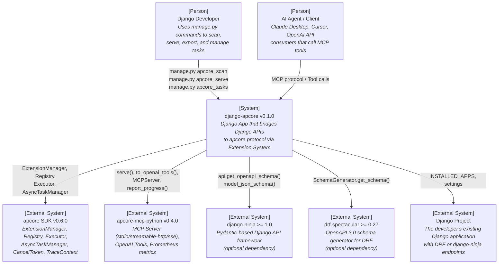
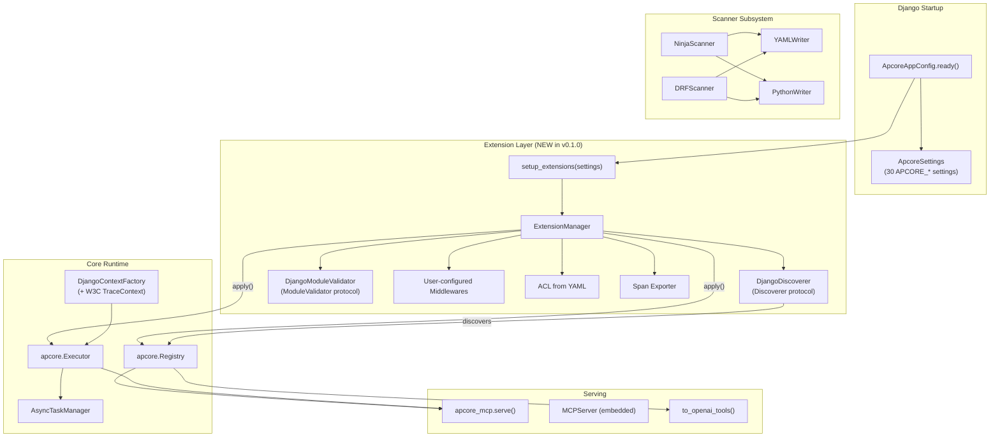
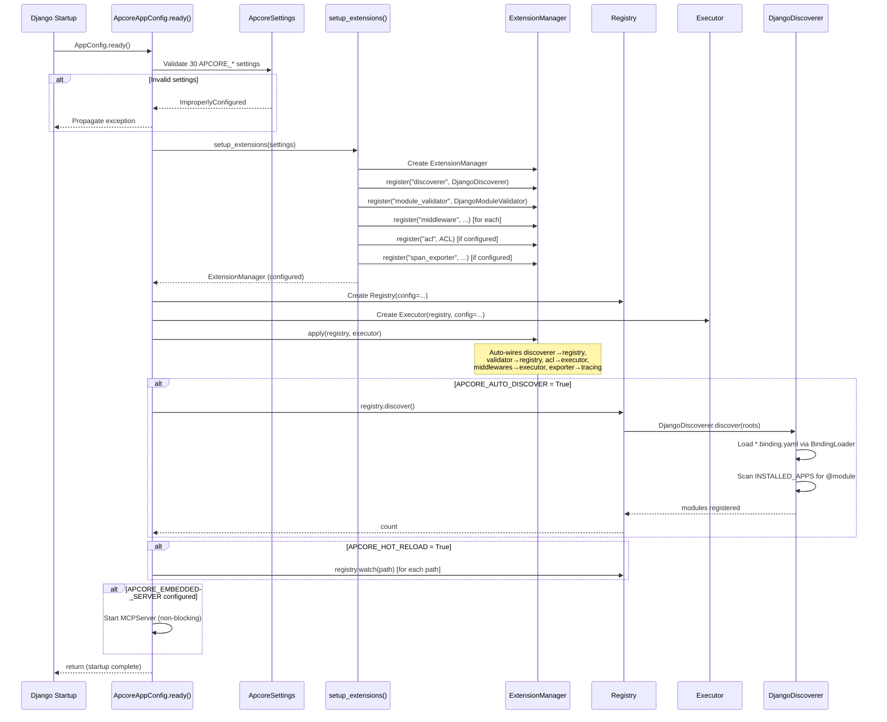
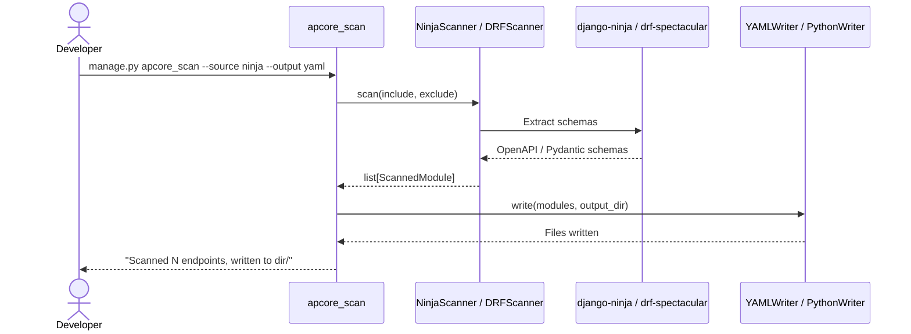
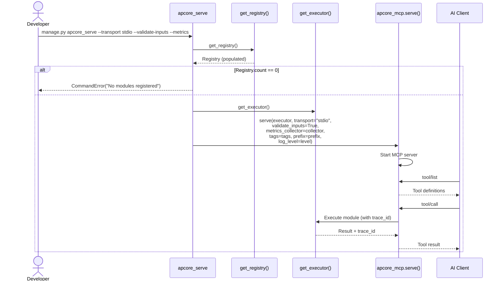
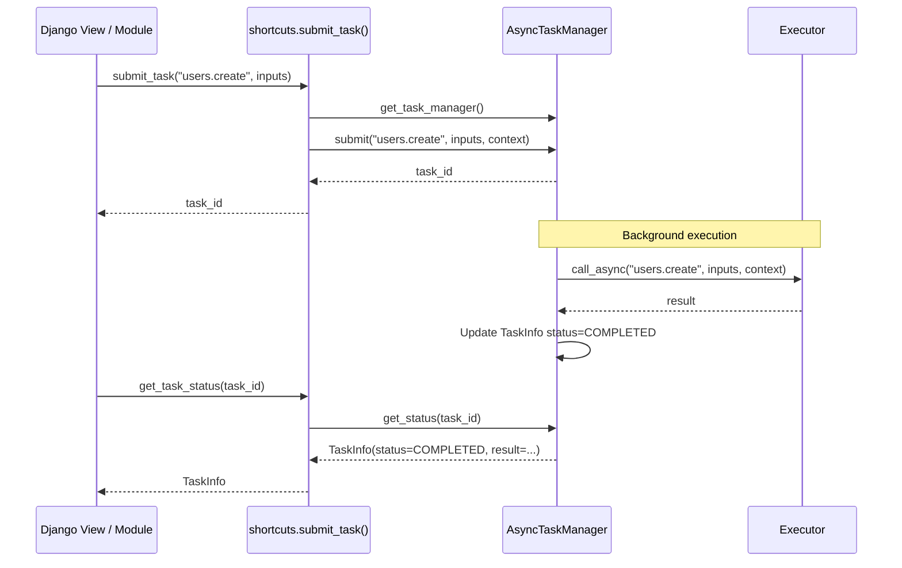

# Technical Design Document: django-apcore

---

## 1. Document Information

| Field | Value |
|-------|-------|
| **Document Title** | Technical Design: django-apcore v0.1.0 |
| **Version** | 2.0 |
| **Author** | Engineering Team |
| **Reviewers** | -- |
| **Date** | 2026-02-23 |
| **Status** | Draft |
| **Related PRD** | [docs/django-apcore/prd.md](./prd.md) |
| **Related Design** | [docs/plans/2026-02-23-v0.1.0-redesign-design.md](../plans/2026-02-23-v0.1.0-redesign-design.md) |

---

## 2. Revision History

| Version | Date | Author | Description |
|---------|------|--------|-------------|
| 1.0 | 2026-02-19 | Engineering Team | Initial technical design based on PRD v1.0 |
| 2.0 | 2026-02-23 | Engineering Team | Full redesign for apcore v0.6.0 + apcore-mcp v0.4.0 (Extension-First architecture) |

---

## 3. Overview

### 3.1 Background

django-apcore is an open-source Django App that brings the apcore (AI-Perceivable Core) protocol to the Django ecosystem. It enables Django developers to expose existing API endpoints as MCP tools and OpenAI-compatible tools without code modification.

The upstream libraries have undergone major releases:
- **apcore v0.6.0**: Introduces Extension System (5 extension points), AsyncTaskManager, CancelToken, W3C TraceContext, enhanced Registry (discoverer/validator hooks, hot-reload), and streaming annotations
- **apcore-mcp v0.4.0**: Requires apcore>=0.6.0, adds Prometheus metrics endpoint, trace_id passback, input validation, and module filtering

This v2.0 technical design fully rebuilds django-apcore around apcore's Extension System as the primary composition mechanism, replacing the manual singleton wiring of v0.2.0.

### 3.2 Goals

- **G1:** Provide a Django App that uses apcore's Extension System for component composition
- **G2:** Scan existing DRF and django-ninja endpoints to produce apcore module definitions with enforced input/output schemas
- **G3:** Expose management commands for scanning, serving, exporting, and task management
- **G4:** Integrate with all apcore v0.6.0 capabilities: Extension System, AsyncTaskManager, CancelToken, TraceContext, hot-reload
- **G5:** Integrate with all apcore-mcp v0.4.0 capabilities: metrics, input validation, module filtering
- **G6:** Maintain a thin wrapper architecture that delegates protocol logic to the apcore SDK and output logic to apcore-mcp-python

### 3.3 Non-Goals

- **NG1:** Django Auth/Permission to apcore ACL mapping
- **NG2:** Django Middleware to apcore Middleware bridging
- **NG3:** Django Admin integration
- **NG4:** Pure Django views scanner (plain views lack structured schemas)
- **NG5:** Database models or migrations (django-apcore is stateless)
- **NG6:** Custom MCP transport implementation (delegates to apcore-mcp-python)

### 3.4 Scope

This design covers all components within the `django_apcore` package:

1. **Core Django App** -- `apps.py`, `settings.py`, `registry.py`, `extensions.py`, `context.py`, `tasks.py`, `shortcuts.py`
2. **Scanner subsystem** -- `scanners/base.py`, `scanners/ninja.py`, `scanners/drf.py`
3. **Output writers** -- `output/yaml_writer.py`, `output/python_writer.py`
4. **Management commands** -- `apcore_scan`, `apcore_serve`, `apcore_export`, `apcore_tasks`

External systems affected: None (read-only integration with django-ninja and DRF APIs; delegates to apcore SDK and apcore-mcp-python).

---

## 4. System Context



---

## 5. Solution Design

### 5.1 Architecture Decision: Extension-First

**Decision:** django-apcore v0.1.0 adopts an Extension-First architecture that uses apcore v0.6.0's `ExtensionManager` as the primary composition mechanism.

**Previous approach (v0.2.0):** Manual singleton wiring — `get_registry()` and `get_executor()` manually configured discoverers, validators, middleware, ACL, and observability.

**New approach (v0.1.0):** Extension-First — `setup_extensions()` registers Django-specific implementations as extensions, then `ExtensionManager.apply(registry, executor)` auto-assembles everything.

**Rationale:**

1. apcore v0.6.0 introduced ExtensionManager specifically for this use case
2. Django's AppConfig discovery pattern maps naturally to apcore's extension point model
3. Reduces boilerplate code (ExtensionManager.apply() replaces manual wiring)
4. Future-proof (new upstream extension points require minimal django-apcore changes)

### 5.2 Architecture Diagram



---

## 6. Detailed Design

### 6.1 Component Overview

```
src/django_apcore/
├── __init__.py                    # v0.1.0, public API exports
├── apps.py                        # ApcoreAppConfig (Extension-First startup)
├── settings.py                    # 30 APCORE_* settings with validation
├── extensions.py                  # ★ NEW: DjangoDiscoverer, DjangoModuleValidator,
│                                  #         setup_extensions()
├── context.py                     # DjangoContextFactory (+ W3C TraceContext)
├── registry.py                    # get_registry(), get_executor(),
│                                  # get_extension_manager() — ExtensionManager delegates
├── tasks.py                       # ★ NEW: get_task_manager(), async task integration
├── shortcuts.py                   # Convenience functions (extended)
├── scanners/
│   ├── __init__.py
│   ├── base.py                    # BaseScanner, ScannedModule
│   ├── ninja.py                   # NinjaScanner
│   └── drf.py                     # DRFScanner
├── output/
│   ├── __init__.py
│   ├── yaml_writer.py             # YAMLWriter
│   └── python_writer.py           # PythonWriter
└── management/commands/
    ├── __init__.py
    ├── apcore_scan.py             # Scanner command
    ├── apcore_serve.py            # Server command (enhanced)
    ├── apcore_export.py           # Export command
    └── apcore_tasks.py            # ★ NEW: Task management command
```

### 6.2 extensions.py — Extension Adapter Layer

This is the core new module. It implements apcore v0.6.0 protocols and wires Django components into the Extension System.

**DjangoDiscoverer** (implements `Discoverer` protocol):

```python
class DjangoDiscoverer:
    """Discovers apcore modules from Django project structure."""

    def __init__(self, settings: ApcoreSettings):
        self._settings = settings

    def discover(self, roots: list[str]) -> list[dict[str, Any]]:
        """
        Discovery sources (in order):
        1. YAML binding files from APCORE_MODULE_DIR matching APCORE_BINDING_PATTERN
           → Loaded via apcore.BindingLoader
        2. @module-decorated functions from INSTALLED_APPS apcore_modules submodules
        """
        ...
```

**DjangoModuleValidator** (implements `ModuleValidator` protocol):

```python
class DjangoModuleValidator:
    """Validates modules against Django-specific rules."""

    def __init__(self, extra_validators: list[ModuleValidator] | None = None):
        self._extra = extra_validators or []

    def validate(self, module: Any) -> list[str]:
        """
        Validation rules:
        1. module_id not in RESERVED_WORDS
        2. module_id within MAX_MODULE_ID_LENGTH
        3. input_schema and output_schema are valid JSON Schema
        4. Delegate to any extra validators from APCORE_MODULE_VALIDATORS
        """
        ...
```

**setup_extensions():**

```python
def setup_extensions(settings: ApcoreSettings) -> ExtensionManager:
    """Build and configure ExtensionManager from Django settings."""
    ext_mgr = ExtensionManager()

    # Discoverer
    ext_mgr.register("discoverer", DjangoDiscoverer(settings))

    # Module validator
    extra_validators = [import_string(v)() for v in settings.MODULE_VALIDATORS]
    ext_mgr.register("module_validator", DjangoModuleValidator(extra_validators))

    # Middlewares
    for mw_path in settings.MIDDLEWARES:
        ext_mgr.register("middleware", import_string(mw_path))

    # ACL
    if settings.ACL_PATH:
        ext_mgr.register("acl", ACL.load(settings.ACL_PATH))

    # Span exporter
    if settings.TRACING:
        exporter = _build_span_exporter(settings.TRACING)
        ext_mgr.register("span_exporter", exporter)

    return ext_mgr
```

### 6.3 context.py — Enhanced DjangoContextFactory

```python
class DjangoContextFactory:
    """Creates apcore Context from Django HttpRequest with W3C TraceContext."""

    def create_context(self, request: Any) -> Context:
        # 1. Extract W3C traceparent header
        trace_parent = TraceContext.extract({
            "traceparent": request.META.get("HTTP_TRACEPARENT", "")
        })

        # 2. Build Identity from Django user
        identity = self._build_identity(request.user)

        # 3. Create Context with trace_parent for distributed tracing
        return Context.create(
            identity=identity,
            trace_parent=trace_parent,
        )

    def _build_identity(self, user) -> Identity:
        if hasattr(user, "is_authenticated") and user.is_authenticated:
            return Identity(
                id=str(user.pk),
                type="user",
                roles=tuple(user.groups.values_list("name", flat=True)),  # tuple, not list
                attrs={"username": user.username},
            )
        return Identity(id="anonymous", type="anonymous", roles=())
```

Key change: `Identity.roles` is `tuple[str, ...]` per apcore v0.6.0 (was `list[str]`).

### 6.4 registry.py — Simplified via ExtensionManager

```python
_registry: Registry | None = None
_executor: Executor | None = None
_ext_manager: ExtensionManager | None = None
_lock = Lock()

def get_extension_manager() -> ExtensionManager:
    """Get or create the ExtensionManager singleton."""
    global _ext_manager
    with _lock:
        if _ext_manager is None:
            settings = get_apcore_settings()
            _ext_manager = setup_extensions(settings)
        return _ext_manager

def get_registry() -> Registry:
    """Get or create the Registry singleton, configured via ExtensionManager."""
    global _registry
    with _lock:
        if _registry is None:
            settings = get_apcore_settings()
            config = Config(settings.EXECUTOR_CONFIG or {})
            _registry = Registry(config=config)
            ext_mgr = get_extension_manager()
            executor = get_executor()
            ext_mgr.apply(_registry, executor)  # Auto-assembly!
        return _registry

def get_executor() -> Executor:
    """Get or create the Executor singleton."""
    global _executor
    with _lock:
        if _executor is None:
            settings = get_apcore_settings()
            config = Config(settings.EXECUTOR_CONFIG or {})
            _executor = Executor(get_registry(), config=config)
        return _executor
```

The key simplification: `ext_mgr.apply(registry, executor)` replaces 30+ lines of manual wiring.

### 6.5 tasks.py — AsyncTaskManager Integration

```python
_task_manager: AsyncTaskManager | None = None
_task_lock = Lock()

def get_task_manager() -> AsyncTaskManager:
    """Get or create the AsyncTaskManager singleton."""
    global _task_manager
    with _task_lock:
        if _task_manager is None:
            settings = get_apcore_settings()
            _task_manager = AsyncTaskManager(
                executor=get_executor(),
                max_concurrent=settings.TASK_MAX_CONCURRENT,
                max_tasks=settings.TASK_MAX_TASKS,
            )
        return _task_manager
```

### 6.6 shortcuts.py — Expanded Convenience API

**Existing shortcuts (preserved):**

```python
def executor_call(module_id: str, inputs: dict | None = None, context: Context | None = None) -> dict:
    """Synchronous module execution via Executor."""

async def executor_call_async(module_id: str, inputs: dict | None = None, context: Context | None = None) -> dict:
    """Asynchronous module execution via Executor."""

async def executor_stream(module_id: str, inputs: dict | None = None, context: Context | None = None) -> AsyncIterator:
    """Streaming module execution via Executor."""

async def report_progress(context: Context, progress: int, total: int | None = None, message: str | None = None) -> None:
    """Report progress to MCP client."""

async def elicit(context: Context, message: str, schema: dict | None = None) -> dict | None:
    """Request user input from MCP client."""
```

**New shortcuts (v0.1.0):**

```python
def cancellable_call(
    module_id: str,
    inputs: dict | None = None,
    context: Context | None = None,
    timeout: float | None = None,
) -> dict:
    """Synchronous execution with CancelToken. Auto-cancels on timeout."""

async def cancellable_call_async(
    module_id: str,
    inputs: dict | None = None,
    context: Context | None = None,
    timeout: float | None = None,
) -> dict:
    """Asynchronous execution with CancelToken. Auto-cancels on timeout."""

async def submit_task(
    module_id: str,
    inputs: dict | None = None,
    context: Context | None = None,
) -> str:
    """Submit async task to AsyncTaskManager. Returns task_id."""

def get_task_status(task_id: str) -> TaskInfo:
    """Query task status from AsyncTaskManager."""

async def cancel_task(task_id: str) -> bool:
    """Cancel a running async task."""
```

### 6.7 apps.py — Extension-First AppConfig

```python
class ApcoreAppConfig(AppConfig):
    name = "django_apcore"
    verbose_name = "apcore Django Integration"

    def ready(self):
        # 1. Validate all APCORE_* settings
        settings = get_apcore_settings()  # Raises ImproperlyConfigured on error

        # 2. Build ExtensionManager
        ext_mgr = get_extension_manager()

        # 3. Create and configure Registry + Executor via ext_mgr.apply()
        registry = get_registry()

        # 4. Auto-discover modules
        if settings.AUTO_DISCOVER:
            count = registry.discover()
            logger.info("Auto-discovery complete: %d modules registered", count)

        # 5. Hot-reload (optional)
        if settings.HOT_RELOAD:
            for path in settings.HOT_RELOAD_PATHS:
                registry.watch(path)
            logger.info("Hot-reload watching %d paths", len(settings.HOT_RELOAD_PATHS))

        # 6. Embedded MCP server (optional)
        if settings.EMBEDDED_SERVER:
            self._start_embedded_server(settings)

        # 7. AsyncTaskManager (optional, lazy)
        # Initialized on first use via get_task_manager()
```

### 6.8 settings.py — Expanded Configuration (30 settings)

**Existing settings (17, preserved):**

| Setting | Type | Default | Purpose |
|---------|------|---------|---------|
| `APCORE_MODULE_DIR` | str | `"apcore_modules/"` | Module directory |
| `APCORE_AUTO_DISCOVER` | bool | `True` | Auto-discover on startup |
| `APCORE_SERVE_TRANSPORT` | str | `"stdio"` | Default MCP transport |
| `APCORE_SERVE_HOST` | str | `"127.0.0.1"` | HTTP host |
| `APCORE_SERVE_PORT` | int | `8000` | HTTP port |
| `APCORE_SERVER_NAME` | str | `"apcore-mcp"` | MCP server name |
| `APCORE_SERVER_VERSION` | str\|None | `None` | MCP server version |
| `APCORE_BINDING_PATTERN` | str | `"*.binding.yaml"` | YAML glob pattern |
| `APCORE_MIDDLEWARES` | list | `[]` | Middleware pipeline |
| `APCORE_ACL_PATH` | str\|None | `None` | ACL file path |
| `APCORE_CONTEXT_FACTORY` | str\|None | `None` | Custom context factory |
| `APCORE_EXECUTOR_CONFIG` | dict\|None | `None` | Executor config dict |
| `APCORE_VALIDATE_INPUTS` | bool | `False` | Input validation |
| `APCORE_OBSERVABILITY_LOGGING` | dict\|None | `None` | Logging middleware |
| `APCORE_TRACING` | dict\|None | `None` | Tracing config |
| `APCORE_METRICS` | dict\|None | `None` | Metrics config |
| `APCORE_EMBEDDED_SERVER` | dict\|None | `None` | Embedded MCP server |

**New settings (13, v0.1.0):**

| Setting | Type | Default | Purpose |
|---------|------|---------|---------|
| `APCORE_EXTENSIONS_DIR` | str\|None | `None` | Custom extensions directory |
| `APCORE_MODULE_VALIDATORS` | list | `[]` | Additional ModuleValidator class paths |
| `APCORE_TASK_MAX_CONCURRENT` | int | `10` | AsyncTaskManager max concurrent tasks |
| `APCORE_TASK_MAX_TASKS` | int | `1000` | AsyncTaskManager max total tasks |
| `APCORE_TASK_CLEANUP_AGE` | int | `3600` | Auto-cleanup age (seconds) |
| `APCORE_CANCEL_DEFAULT_TIMEOUT` | int\|None | `None` | Default cancel timeout (ms) |
| `APCORE_SERVE_VALIDATE_INPUTS` | bool | `False` | MCP server input validation |
| `APCORE_SERVE_METRICS` | bool | `False` | Enable Prometheus /metrics |
| `APCORE_SERVE_LOG_LEVEL` | str\|None | `None` | MCP server log level |
| `APCORE_SERVE_TAGS` | list\|None | `None` | Filter modules by tags |
| `APCORE_SERVE_PREFIX` | str\|None | `None` | Filter modules by ID prefix |
| `APCORE_HOT_RELOAD` | bool | `False` | Enable Registry hot-reload |
| `APCORE_HOT_RELOAD_PATHS` | list | `[]` | Paths to watch |

### 6.9 Management Commands

#### `apcore_serve` (enhanced)

| Argument | Type | Default | Description |
|----------|------|---------|-------------|
| `--transport` | choice | `APCORE_SERVE_TRANSPORT` | stdio, streamable-http, sse |
| `--host` | string | `APCORE_SERVE_HOST` | HTTP host |
| `--port` | int | `APCORE_SERVE_PORT` | HTTP port |
| `--name` | string | `APCORE_SERVER_NAME` | Server name |
| `--version` | string | `APCORE_SERVER_VERSION` | Server version |
| `--validate-inputs` | flag | `False` | Enable input validation |
| `--metrics` | flag | `False` | Enable Prometheus /metrics |
| `--log-level` | choice | `None` | DEBUG, INFO, WARNING, ERROR, CRITICAL |
| `--tags` | string | `None` | Comma-separated tag filter |
| `--prefix` | string | `None` | Module ID prefix filter |

#### `apcore_tasks` (new)

| Subcommand | Arguments | Description |
|------------|-----------|-------------|
| `list` | `--status STATUS` | List tasks, optionally filtered |
| `cancel` | `TASK_ID` | Cancel a running task |
| `cleanup` | `--max-age SECONDS` | Clean up completed tasks |

#### `apcore_scan` (unchanged)
#### `apcore_export` (unchanged)

---

## 7. Core Workflows

### 7.1 Extension-First Startup Flow



### 7.2 Scan Flow (unchanged from v0.2.0)



### 7.3 Serve Flow (enhanced)



### 7.4 Async Task Flow (new)



---

## 8. Technology Stack

| Layer | Technology | Version | Rationale |
|-------|-----------|---------|-----------|
| Language | Python | 3.11+ | Matches apcore v0.6.0 requirement |
| Web Framework | Django | 4.2+ | Current LTS target |
| Schema Library | Pydantic | 2.0+ | Used by apcore and django-ninja |
| Core Protocol | apcore SDK | 0.6.0+ | Extension System, AsyncTaskManager, CancelToken, TraceContext |
| MCP Output | apcore-mcp-python | 0.4.0+ | Metrics, validation, filtering |
| Ninja Scanner | django-ninja | 1.0+ | Optional |
| DRF Scanner | drf-spectacular | 0.27+ | Optional |
| YAML | PyYAML | 6.0+ | Binding files |
| Testing | pytest + pytest-django + pytest-asyncio | 8.0+ / 4.5+ / 0.23+ | Standard |
| Linting | ruff | 0.4+ | Linter + formatter |
| Type Checking | mypy | 1.10+ | Static analysis |
| Build | hatchling | 1.20+ | PEP 517 |

---

## 9. Dependencies

```toml
[project]
requires-python = ">=3.11"
dependencies = [
    "django>=4.2",
    "apcore>=0.6.0",
    "pyyaml>=6.0",
]

[project.optional-dependencies]
mcp = ["apcore-mcp>=0.4.0"]
ninja = ["django-ninja>=1.0"]
drf = ["drf-spectacular>=0.27"]
dev = [
    "pytest>=8.0",
    "pytest-django>=4.5",
    "pytest-asyncio>=0.23",
    "ruff>=0.4",
    "mypy>=1.10",
]
all = ["django-apcore[mcp,ninja,drf]"]
```

---

## 10. Security Design

### 10.1 Authentication / Authorization

Not applicable for MVP. Consistent with Non-Goals NG1. The `apcore_serve` command starts an MCP server accessible without authentication. HTTP transports default to `127.0.0.1` (localhost only).

### 10.2 Input Sanitization

- **Settings:** Validated by `ApcoreSettings` with strict type checking
- **YAML files:** Parsed by PyYAML's `safe_load()` (no arbitrary Python execution)
- **Module inputs:** Validated by Pydantic schemas via Executor pipeline
- **MCP inputs:** Optional validation via `--validate-inputs` flag
- **Generated code:** Not executed at generation time

### 10.3 Sensitive Data

- `DjangoContextFactory` does not expose sensitive user attributes
- apcore v0.6.0's recursive `_secret_` key redaction is inherited
- Context data is not logged by default

---

## 11. Performance Targets

| Metric | Target |
|--------|--------|
| `apcore_scan` (50 endpoints) | < 10 seconds |
| `apcore_scan` (200 endpoints) | < 30 seconds |
| Auto-discovery (100 modules) | < 2 seconds |
| Extension-First startup overhead | < 500ms vs manual wiring |
| MCP tool/list response | < 100ms |
| Memory (100 modules) | < 50 MB |

---

## 12. Observability

### 12.1 Logging

- Logger: `django_apcore`
- Uses Django's logging configuration
- Log levels: DEBUG (per-endpoint detail), INFO (summaries), WARNING (non-fatal), ERROR (failures)

### 12.2 Tracing

- W3C TraceContext propagation via `DjangoContextFactory`
- Span export via configurable `SpanExporter` (stdout, in-memory, OTLP)
- Registered as extension: `ext_mgr.register("span_exporter", exporter)`

### 12.3 Metrics

- Prometheus metrics via `MetricsCollector` → `/metrics` endpoint on HTTP transports
- Configured via `APCORE_SERVE_METRICS = True`
- Includes: execution duration histogram, call counts, error counts

---

## 13. Testing Strategy

| Component | Test File | Key Test Cases |
|-----------|-----------|----------------|
| extensions.py | `test_extensions.py` | DjangoDiscoverer (binding.yaml + @module), DjangoModuleValidator, setup_extensions |
| context.py | `test_context.py` | TraceContext extraction, Identity with tuple roles, anonymous user |
| registry.py | `test_registry.py` | ExtensionManager-based assembly, singletons, thread safety |
| tasks.py | `test_tasks.py` | AsyncTaskManager lifecycle, submit/cancel/cleanup |
| shortcuts.py | `test_shortcuts.py` | cancellable_call, submit_task, cancel_task, timeout |
| settings.py | `test_settings.py` | All 30 settings validation |
| apps.py | `test_app.py` | Extension-First startup, hot-reload, embedded server |
| apcore_tasks | `test_commands.py` | list/cancel/cleanup subcommands |
| apcore_serve | `test_serve_command.py` | New flags: validate-inputs, metrics, tags, prefix |
| Integration | `test_registry_serve.py` | Full Extension-First pipeline |

---

## 14. Migration from v0.2.0

### 14.1 Breaking Changes

1. **Minimum Python**: 3.10 → 3.11
2. **Minimum apcore**: 0.5.0 → 0.6.0
3. **Minimum apcore-mcp**: 0.3.0 → 0.4.0
4. **Identity.roles**: `list[str]` → `tuple[str, ...]` (upstream change)
5. **Internal startup**: Manual wiring → ExtensionManager.apply()

### 14.2 Migration Path

For users:
1. Update `pyproject.toml` / `requirements.txt` to pin new versions
2. No public API changes are breaking — `get_registry()`, `get_executor()`, all shortcuts work the same
3. `Identity.roles` change is transparent (DjangoContextFactory handles it internally)
4. New settings are all optional with sensible defaults

---

## 15. Open Questions

| ID | Question | Status | Decision |
|----|----------|--------|----------|
| OQ-001 | Sync Django ORM in async MCP contexts | Resolved | apcore Executor handles sync-to-async bridging |
| OQ-002 | One YAML file per module vs per app | Resolved | One per module (default), configurable |
| OQ-003 | Scanner quality bar for incomplete schemas | Resolved | Include with warning |
| OQ-004 | Auth-protected endpoint handling | Resolved | Include all endpoints, no auth metadata in MVP |
| DR-001 | Architecture: Extension-First | Decided | Use ExtensionManager as primary composition mechanism |
| DR-002 | Dependency packaging: extras | Decided | `pip install django-apcore[ninja]` pattern |
| DR-003 | Registry lifecycle: singleton | Decided | Process-level singleton, ExtensionManager assembly |

---

## 16. Appendix

### A. Package Structure

```
django-apcore/
  src/django_apcore/
    __init__.py
    apps.py
    settings.py
    extensions.py          # NEW
    context.py
    registry.py
    tasks.py               # NEW
    shortcuts.py
    scanners/
      __init__.py
      base.py
      ninja.py
      drf.py
    output/
      __init__.py
      yaml_writer.py
      python_writer.py
    management/
      __init__.py
      commands/
        __init__.py
        apcore_scan.py
        apcore_serve.py
        apcore_export.py
        apcore_tasks.py    # NEW
  tests/
    ...
  docs/
    django-apcore/
      prd.md
      tech-design.md
      upstream-sdk-analysis.md
  pyproject.toml
  README.md
```

### B. References

- apcore v0.6.0: `/Users/tercel/WorkSpace/aipartnerup/apcore-python/`
- apcore-mcp v0.4.0: `/Users/tercel/WorkSpace/aipartnerup/apcore-mcp-python/`
- Upstream SDK Analysis: [docs/django-apcore/upstream-sdk-analysis.md](./upstream-sdk-analysis.md)
- Redesign Design: [docs/plans/2026-02-23-v0.1.0-redesign-design.md](../plans/2026-02-23-v0.1.0-redesign-design.md)

---

*End of document.*
