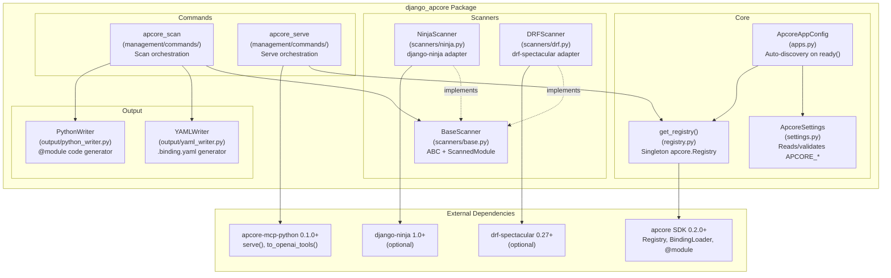
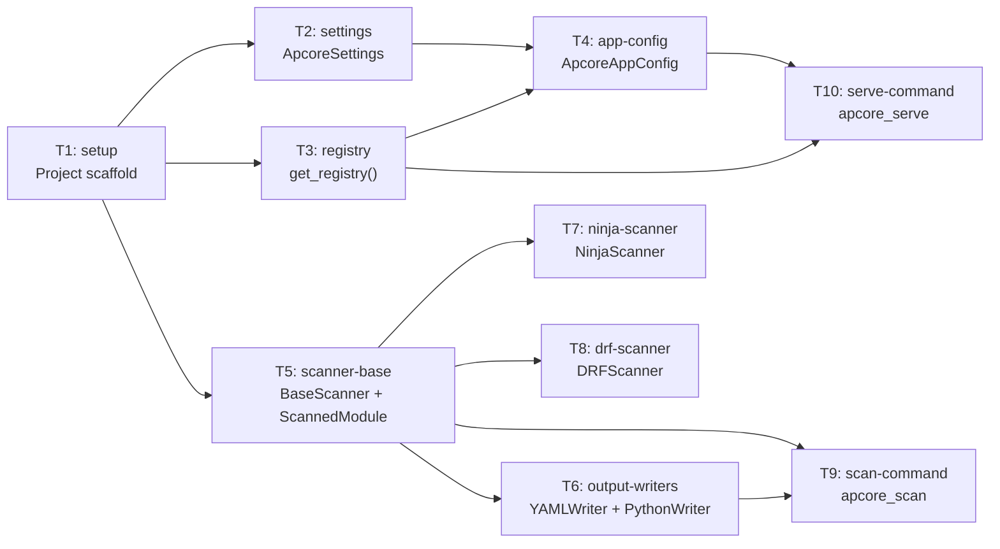

# Implementation Plan: django-apcore

## Goal

Implement django-apcore, a thin-wrapper Django App that bridges the apcore (AI-Perceivable Core) protocol to the Django ecosystem by scanning existing DRF and django-ninja endpoints into apcore module definitions and serving them via MCP.

---

## Architecture

### Component Diagram

### Data Flow

1. **Scan Flow:** Developer runs `manage.py apcore_scan --source ninja --output yaml`. The command instantiates the appropriate scanner, which extracts endpoint schemas from the Django API framework (django-ninja or DRF via drf-spectacular). Results are normalized to `ScannedModule` dataclasses, then written to disk by the selected output writer (YAML binding files or Python @module files).

2. **Serve Flow:** Developer runs `manage.py apcore_serve --transport stdio`. The command calls `get_registry()` to obtain the singleton apcore Registry (populated during auto-discovery or manually), validates that modules exist, then delegates to `apcore_mcp.serve()` which starts the MCP server.

3. **Auto-Discovery Flow:** On Django startup, `ApcoreAppConfig.ready()` validates settings, loads YAML binding files via `apcore.BindingLoader`, scans INSTALLED_APPS for `@module`-decorated functions, and registers all discovered modules in the singleton Registry.

---

## Technology Stack

| Layer | Technology | Version | Purpose |
|-------|-----------|---------|---------|
| Language | Python | 3.10+ | `\|` union types, ParamSpec |
| Web Framework | Django | 4.2+ | Target framework (LTS) |
| Schema Library | Pydantic | 2.0+ | Schema definition, used by apcore SDK and django-ninja |
| Core Protocol | apcore SDK | 0.2.0+ | Registry, Executor, @module, BindingLoader |
| MCP Output | apcore-mcp-python | 0.1.0+ | serve(), to_openai_tools() |
| Ninja Scanner | django-ninja | 1.0+ | Optional; get_openapi_schema(), Pydantic models |
| DRF Scanner | drf-spectacular | 0.27+ | Optional; SchemaGenerator for OpenAPI 3.0 |
| YAML | PyYAML | 6.0+ | Binding file I/O |
| Testing | pytest + pytest-django | 8.0+ / 4.5+ | Test runner, Django fixtures |
| Linting | ruff | 0.4+ | Linter and formatter |
| Type Checking | mypy | 1.10+ | Static type analysis |
| Build | hatchling | 1.20+ | PEP 517 build backend |

---

## Task Breakdown

### Dependency Graph

### Task List

| # | Task ID | Title | Files | Est. Hours | Dependencies | Acceptance Criteria |
|---|---------|-------|-------|-----------|--------------|---------------------|
| 1 | setup | Project scaffold | `pyproject.toml`, `src/django_apcore/__init__.py`, directory structure, `.github/workflows/ci.yml`, `ruff.toml`, `mypy.ini` | 3h | None | `pip install -e ".[dev]"` succeeds; `ruff check` passes; `mypy` passes; `pytest` runs (0 tests); directory structure matches tech-design Appendix E |
| 2 | settings | ApcoreSettings | `src/django_apcore/settings.py`, `tests/test_settings.py` | 3h | setup | All 7 APCORE_* settings read with correct defaults; invalid types raise `ImproperlyConfigured`; `get_apcore_settings()` returns frozen dataclass; 100% coverage |
| 3 | registry | Registry wrapper | `src/django_apcore/registry.py`, `tests/test_registry.py` | 2h | setup | `get_registry()` returns singleton `apcore.Registry`; second call returns same instance; modules can be registered; 100% coverage |
| 4 | app-config | ApcoreAppConfig | `src/django_apcore/apps.py`, `tests/test_app.py` | 4h | settings, registry | `ready()` validates settings; auto-discovery loads YAML bindings and @module functions; `APCORE_AUTO_DISCOVER=False` skips discovery; missing module dir logs warning; 90% coverage |
| 5 | scanner-base | BaseScanner + ScannedModule | `src/django_apcore/scanners/__init__.py`, `src/django_apcore/scanners/base.py`, `tests/test_scanner_base.py` | 2h | setup | `ScannedModule` dataclass has all 8 fields; `BaseScanner` enforces `scan()` and `get_source_name()` ABCs; include/exclude filtering works; 100% coverage |
| 6 | output-writers | YAMLWriter + PythonWriter | `src/django_apcore/output/__init__.py`, `src/django_apcore/output/yaml_writer.py`, `src/django_apcore/output/python_writer.py`, `tests/test_yaml_writer.py`, `tests/test_python_writer.py` | 4h | scanner-base | YAML output compatible with `apcore.BindingLoader`; Python output is valid PEP 8 code with correct @module decorators; directory creation; overwrite warnings; 100% coverage |
| 7 | ninja-scanner | NinjaScanner | `src/django_apcore/scanners/ninja.py`, `tests/test_scanner_ninja.py`, `tests/fixtures/ninja_project/` | 4h | scanner-base | Scans NinjaAPI instances from URL patterns; extracts Pydantic input/output schemas; generates correct module IDs per BL-001; handles missing descriptions (BL-004); 90% coverage |
| 8 | drf-scanner | DRFScanner | `src/django_apcore/scanners/drf.py`, `tests/test_scanner_drf.py`, `tests/fixtures/drf_project/` | 4h | scanner-base | Uses drf-spectacular SchemaGenerator; extracts serializer schemas; generates correct module IDs per BL-002; handles SerializerMethodField (BL-011); 90% coverage |
| 9 | scan-command | apcore_scan management command | `src/django_apcore/management/__init__.py`, `src/django_apcore/management/commands/__init__.py`, `src/django_apcore/management/commands/apcore_scan.py`, `tests/test_commands.py` | 4h | scanner-base, output-writers | All arguments parsed and validated per Section 7.3; dispatches to correct scanner and writer; dry-run mode works; proper error messages; exit codes 0/1; 90% coverage |
| 10 | serve-command | apcore_serve management command | `src/django_apcore/management/commands/apcore_serve.py`, `tests/test_commands.py` (extended), `tests/integration/` | 3h | app-config, registry | All arguments parsed and validated per Section 7.3; delegates to `apcore_mcp.serve()`; empty registry raises CommandError; transport validation works; integration test confirms registry-to-serve flow; 85% coverage |

---

## Risks and Considerations

| Risk | Likelihood | Impact | Mitigation |
|------|-----------|--------|-----------|
| apcore SDK 0.2.0 API changes before django-apcore ships | Medium | High | Pin to `>=0.2.0,<0.3.0`; maintain close communication (same developer controls both projects) |
| Django ORM sync calls in async MCP context | Medium | Medium | apcore SDK Executor supports sync-to-async bridging; fallback to `sync_to_async()` wrapper |
| drf-spectacular schema incomplete for complex serializers | Medium | Low | Graceful degradation with warnings (BL-011); document known limitations |
| django-ninja OpenAPI schema missing for certain endpoint patterns | Low | Low | Test with diverse endpoint patterns; fallback to permissive schemas |
| Optional dependency import errors at runtime | Low | Medium | Lazy imports with clear error messages pointing to `pip install django-apcore[extra]` |

---

## Acceptance Criteria

### Functional

- [ ] `pip install django-apcore` installs with no errors on Python 3.10-3.13
- [ ] Adding `"django_apcore"` to `INSTALLED_APPS` works with zero additional configuration
- [ ] `manage.py apcore_scan --source ninja --output yaml` produces valid binding files
- [ ] `manage.py apcore_scan --source drf --output python` produces valid @module Python files
- [ ] `manage.py apcore_serve --transport stdio` starts an MCP server with discovered modules
- [ ] Auto-discovery on startup loads YAML bindings and @module functions into the registry
- [ ] Missing optional dependencies produce clear error messages with install instructions

### Quality

- [ ] All public APIs have type annotations verified by mypy
- [ ] ruff check passes with zero violations
- [ ] Unit test coverage >= 90% overall, 100% for settings and registry
- [ ] All tests follow strict TDD: written before implementation, verified to fail, then pass
- [ ] Generated YAML is compatible with `apcore.BindingLoader`
- [ ] Generated Python code is PEP 8 compliant and importable

### Performance

- [ ] `apcore_scan` completes in < 10 seconds for 50 endpoints
- [ ] Auto-discovery completes in < 2 seconds for 100 modules
- [ ] Memory overhead < 50 MB for 100 registered modules
